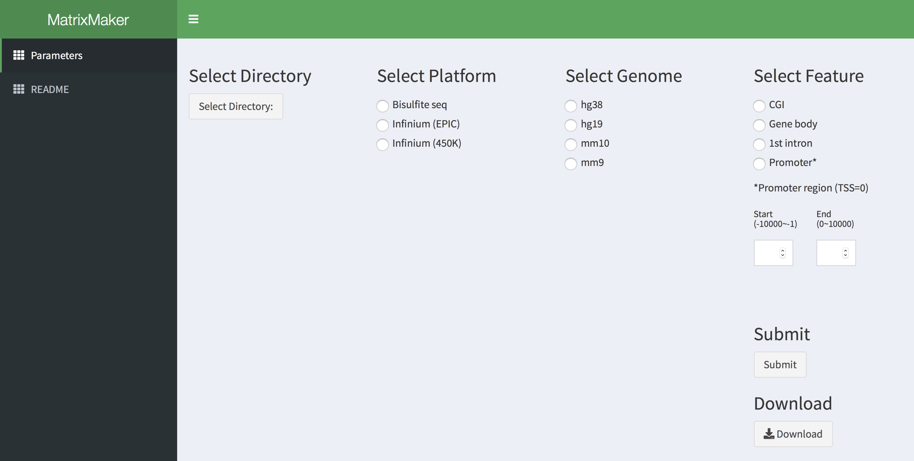

# MatrixMaker
## GUI tool for converting methyole data to a data matrix compatible with Methylica
*MatrixMaker* is a GUI-based tool for converts methylome data to a data matrix compatible with [*Methylica*](https://github.com/HiromitsuAraki/Methylica). 

## Install/Launch MatrixMaker
1.  Install [R environment](https://www.r-project.org/)
2.  Install [shiny](https://shiny.rstudio.com).  
`install.packages("shiny")`
3.  Launch *MatrixMaker*  
The following R code will launch *MatrixMaker*.  
`shiny::runGitHub("HiromitsuAraki/MatrixMaker")`
 

## Input file format
*MatrixMaker* accepts two types of methylome data, which are sequence-based methylome data, such as whole-genome bisulfite sequencing (WGBS) or Reduced Representation Bisulfite Sequencing (RRBS), and Infinium methylation array data (MethylationEPIC and 450k). Users for seuqence-basd methylome data need to prepare BED format files of each sample generated by general methylation calling tools, such as [BSMAP](https://www.ncbi.nlm.nih.gov/pubmed/19635165) or [Bismark](https://www.ncbi.nlm.nih.gov/pubmed/21493656). Users for infinium methylation array need to prepare *Methylation Profile table* generated by  [GenomeStudio](http://jp.support.illumina.com/array/array_software/genomestudio.html). Each data format is shown as below.
- Seuqence-basd methylome data
  - 1st column: Chr
  - 2nd column: Start
  - 3rd column: End
  - 4th column: Strand
  - 5th column: Methylated reads
  - 6th column: Total reads
   
- Infinium methylation array data
  - 1st column: Target ID
  - 2nd column ~ : beta value
  
 

## Implementations
### Data uploading and parameter setting
*MatrixMaker* requires methylome data as its inputs. Please refer **Input file format** about the file format of methylome data. As for the data uploading, users need to prepare and select a directory or folder in which only BED format files or *Methylation Profile table* are stored. Following data upload, 

*MatrixMaker* requests its users to select species with its reference genome version, genomic elements (CpG island, gene body, first intron and promoter). and k or the number of ICs (minimum = 2; maximum = the number of samples). *Methylica* provides a default setting of k, defined as the first k components whose cumulative contribution ratio exceeds 80% in principal component analysis. When users select all parameters, users need to press "Run" button to start analysis.

 
